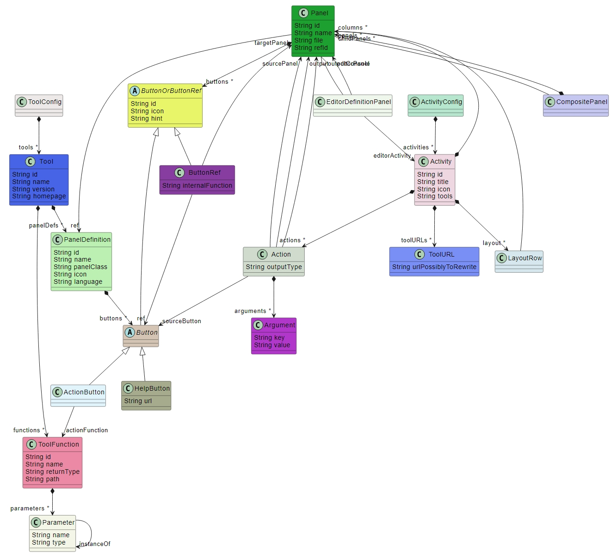
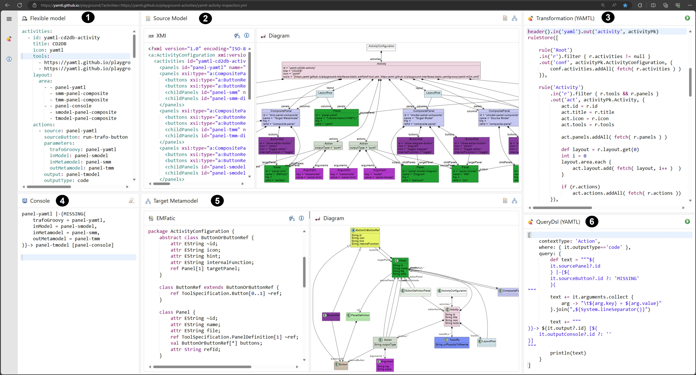

---
hide:
  - path
---

# Analysis of Activity Configurations for the Education Platform

The [MDENet education platform](https://github.com/mdenet/educationplatform) aims to allow users to quickly start learning fundamental model-driven engineering techniques via a web browser. Learning activities are defined via configuration files that consist of two parts, tool identification and specification of activity:

* **Tool specification**: references the API specification of a specific MDE tool to be used in a learning activity.
* **Activity specification**: defines the specific UI elements and action buttons available to the user and what they do. What panes are available and what additional configuration information they require, depends on the tools being used.

In this example, we illustrate how to use YAMTL to import activity configurations, available as YAML or JSON files, as [flexible models](https://yamtl.github.io/examples/flexible-models.html) in order to transform them to metamodel-based models so that they can be visuallized and analyzed. [YAMTL model queries](https://yamtl.github.io/examples/query-dsl.html) are used to inspect them, aiding in both understanding and debugging. 

Education platform configuration files can be inspected with YAMTL interactively via 🔍 [this activity](https://yamtl.github.io/playground/?activities=https://yamtl.github.io/playground-activities/yamtl-activity-inspection.yml) on the education platform itself.

## Importing Activity Configurations as Models

Activity and tool specifications are defined using YAML or JSON configuration files that specify the layout of the front-end UI and the examples used in the activities, according to the configuration language below. 

The activity shown in the screenshot below displays the YAML configuration file **(1)** of [this activity](https://yamtl.github.io/playground/?activities=https://yamtl.github.io/playground-activities/yamtl-demo-activity.yml), the YAMTL model transformation **(3)** from the YAML/JSON **(1)** file to a model **(2)** that conforms to the education platform activity language **(5)**, shown above, converting references by name in the YAML configuration file to references by value in the model. 

The left-hand side panel can display multiple activities when included in the same configuration file. Consequently, these configurations can become lengthy and challenging to debug, more so considering that YAML does not enforce a data schema. The benefit of this activity is that activity configurations can be treated as flexible models using YAMTL in order to transform them to statically-typed models that can be visualized as object graphs using object diagram notation, as shown in the composite panel **(2)**.

## Activity Configuration Analysis

This example uses [YAMTL model queries](https://yamtl.github.io/examples/query-dsl.html) **(6)** for defining object-oriented queries over models built atop the [YAMTL pattern matcher](https://yamtl.github.io/yamtl-reference.html#pattern-matching-semantics). 

Queries are defined as records, resembling JSON documents, with the following fields: 

* a `context` type from the metamodel **(5)**; 
* a `where` Groovy closure that specifies which objects from the model **(2)** are affected by the query; and 
* a `query` Groovy closure that traverses the model from an instance of the `context` type, printing the desired information in the output stream, which is displayed on the console **(4)**. 

The query in the example finds out how the activity actions prompt UI state changes, by listing the `source-panel` containing the action, the button linked to the action, the argument binding for the parameters of the MDE tool linked to the action, and the `target-panel` containing the results of the tool and any additional `output` side effects, using the format `source-panel |-{ button(parameter-binding)}-> target-panel [output]`. In this query, when the button identifier cannot be resolved, `MISSING` is displayed to report an error.

🔍 [This interactive activity](https://yamtl.github.io/playground/?activities=https://yamtl.github.io/playground-activities/yamtl-activity-inspection.yml) shows an example where the tool specification is missing and one where the tool specification is provided.

## Wrap-up

This example shows how to import YAML/JSON activity configurations as flexible models in YAMTL. The transformation from flexible configuration models to metamodel-based configuration models enables easier visualization and analysis, allowing seamless combination with other MDE tools and simplifying the process of defining and debugging new learning activities collaboratively via the education platform.