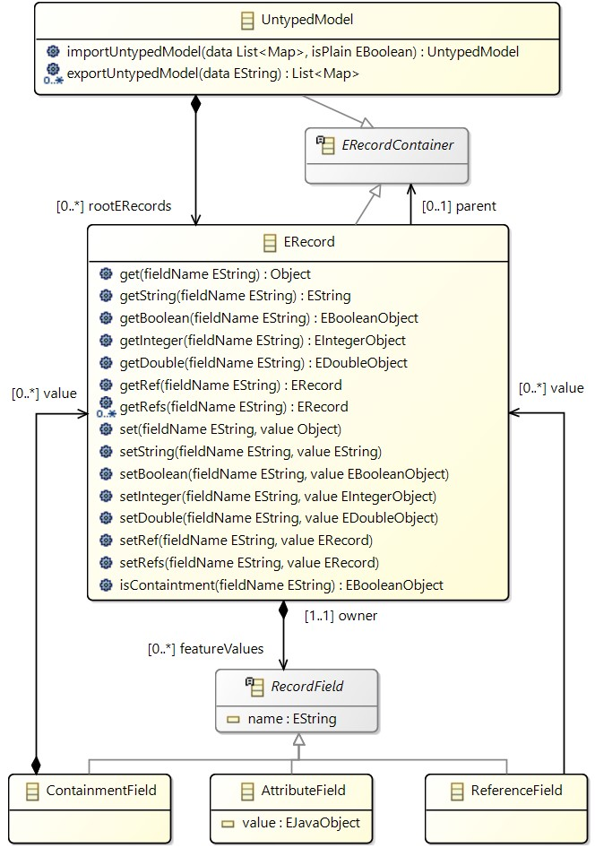
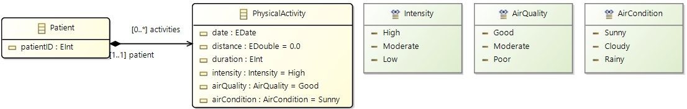

---
hide:
  - path
---

# Transformations with Flexible Models

Flexible models allow for the transformation of semi-structured data, which combines structured elements (like tags) with unstructured components (like free text) without adhering to a fixed schema (or metamodel). This flexibility is beneficial in fields like big data and data integration, enabling the handling of diverse data sources without schema constraints.

In this example, we show how to load CSV data as a flexible model and how to transform it to a metamodel-based model.

## Semi-structured Data

Semi-structured data combines elements of structure, like tags, with unstructured components such as free text, without adhering to a fixed schema like a metamodel. This flexibility is beneficial in fields like big data and data integration, enabling the handling of diverse data sources without schema constraints. Despite its versatility, semi-structured data lacks the rigor of structured data models, which facilitate processing, manipulation, and analysis using Model-Driven Engineering (MDE) techniques.

It is common to encounter datasets that are stored in semi-structured formats, such as CSV files. The dataset in Table 1 represents a collection of physical activity data recorded for a group of patients. The data includes information about the date, time, distance, intensity, air quality, air temperature, and heart rate of each physical activity performed by the patients. This is an example where the dataset consists of plain tuples, where there are no further relationships between fields of the tuple other than belonging to the tuple. The dataset contains examples of heterogeneous data, with intensity and air quality measured using different scales and variations in date format and units of measurement for distance and temperature. Additionally, inconsistencies exist in the formatting of the data, with air temperature sometimes not written consistently and the blank space between figures and units occasionally missing. Furthermore, the dataset includes gaps that indicate a lack of data for certain fields.

| Patient ID | Date          | Time  | Distance | Intensity | Air Quality | Air Temperature | Heart Rate (bpm) |
|------------|---------------|-------|----------|-----------|-------------|-----------------|------------------|
| 1          | 01/03/2023    | 10:00 | 2.5 miles| Moderate  | Good        | 20 C            | 72               |
| 1          | 01/03/2023    | 11:00 | 3.0 miles| High      | Excellent   | 22C             | 78               |
|            | 1 March 2023  | 10:00 | 1.5 km   | 2         | 1           |                 |                  |
| 2          | 1 March 2023  | 11:00 | 2.0 km   |           | 3           | 68 F            |                  |

## Flexible Models

To enable the use of flexible models, we define a metamodel that can represent the structure of models that do not have a fixed metamodel. This allows us to handle semi-structured data within MDE frameworks. The metamodel consists of the following main elements:

- **UntypedModel**: Represents the overall model.
- **ERecord**: Represents an instance of a semi-structured EObject.
- **RecordField**: Abstract class representing a field of an EObject, either an **AttributeField** containing a value, a **ReferenceField** referring to another EObject, or a **ContainmentField** containing other ERecords.

The class diagram below illustrates the metamodel for flexible models for presentation purposes. 



The `ERecord` class offers a dynamically-typed interface that provides accessor and mutator methods that encapsulate its implementation. Accessor methods define how to retrieve field values. The accessor `get(fieldName)` returns the value of a field `fieldName` as a Java Object. Since the semi-structured model operates with the absence of metamodel information, there is a mutator operation for each type of field, with upsert semantics. That is, whenever a mutator operation is called, it either inserts the field value if not present in the `ERecord` and, if present, it overrides it. These accessor/mutator methods are implemented both as static methods of the class `ERecordUtil` so that languages like Xtend can use static extensions, and as methods of the the specialized class `ERecordImplAccessors` of `ERecord` (i.e. of `ERecordImpl` in the generated EMF code) so that languages like Java can use them.

The `UntypedModel` class serves as an intermediary abstraction layer between databinding libraries and model management APIs. This layer offers several design benefits:

- **Decoupling Data Sources**: Enables extraction of semi-structured data from various heterogeneous sources in a unified way.
- **Modular Design**: Encapsulates design concerns common across various semi-structured data sources.
- **Consistent Performance**: Ensures consistent performance across different data sources by providing a common interface.
- **Interoperability**: Enables interaction at an object-level without relying on extraneous third-party APIs.

The `UntypedModel` import/export methods are used internally and they are used from the YAMTL I/O interface `loadInputModel` and `saveOutputModels`, as shown below. 

## Transforming Semi-Structured Data

The goal of this example is to transform raw and semi-structured data into a more meaningful and structured model. We will be transforming a CSV dataset into an instance of the following metamodel `PA` describing physical activities recorded for patients.



The following example demonstrates how to define a transformation to convert semi-structured data into a structured model using YAMTL:

```groovy
header().in('csv').out('pa', PA)

ruleStore([
    rule('Activity')
        .in('r')
        .out('a', PA.physicalActivity) {
            def p = getPatient(['patient_id' : r.patient_id])
            p.activities += a
            
            def date = r.date
            def time = r.time
            def dateFormat = new SimpleDateFormat("MM/dd/yyyy HH:mm")
            a.date = dateFormat.parse(date + " " + time)
            a.duration = r.duration_minutes.toInteger()
            a.distance = r.distance_km.toDouble()
            a.intensity = Intensity.get(r.intensity)
            a.airCondition = AirCondition.get(r.air_condition)
            a.airQuality = AirQuality.get(r.air_quality)
        }
])  

helperStore([
    staticOperation('getPatient') { 
        def p = PAFactory.createPatient()
        p.patientID = Integer.valueOf(patient_id)
        p
    }
])
```

In the transformation header, the dataset is loaded as an untyped model using the domain name `csv`, without specifying any metamodel. The output domain corresponds to the metamodel `PA` shown above, so the model transformation will create models conforming to this metamodel. `PA` must be the EPackage containing the declaration of the metamodel classifiers.

In the rule `Activity`, the MT assumes that each row of a dataset is available in memory as an `ERecord`, by not specifying the type of the `in` element `r`. The rule matches each row in the dataset and creates `Patient` and `PhysicalActivity` instances. Each row is translated into a `PhysicalActivity` instance, and each unique `patient_id` in a row gives rise to a `Patient` instance that is related to the `PhysicalActivity` instance corresponding to the row. 

The static operation `getPatient` retrieves the argument `patient_id` from the execution context using the parameter name and returns a new `Patient` instance. Static operations cache the result for each unique invocation, ensuring that only one `Patient` instance is created for each `patient_id`.


### Running the Transformation

The transformation is executed with the usual steps:

```groovy
val xform = new CSV2PA()
YAMTLGroovyExtensions.init(xform) // to load Groovy extensions
xform.loadInputModels(['csv': 'path/to/input.csv'])
xform.execute()
xform.saveOutputModels(['pa': 'path/to/output.xmi'])
```

The methods `loadInputModels`/`saveOutputModels` from the `YAMTLModule` I/O interface will select the right data conversion based on the given file extension:
* `csv`, `json`, `yml`, `xml` are associated with the metamodel of flexible models described above,
* `xmi` is assumed to correspond to an EMF model whose metamodel has already been loaded.

The code for the transformation below can be found [here](https://github.com/yamtl/examples/tree/master/flexibleModels) (`src/main/groovy/flexibleModels` contains the definition of transformations and `src/test/groovy/flexibleModels` how to execute them with some example models).

