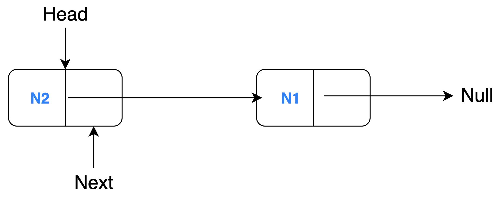

---
hide:
  - path
---

# Linked List Reversal

## Problem Description

Let's see a simple example where a linked list with 2 nodes (N1 and N2) is reversed through model transformation.

A linked list is a collection of sequentially connected nodes where each node contains some data and a reference (pointer) to the next node. The head of a linked list is the first node of the list i.e. the node that is not being referenced. The node at the end (tail) cannot point to the next node hence it references to ``null``. A regular linked list comprises of these characteristics, so, we need to just change them appropriately to reverse the order of the nodes.

**Source Model**
<figure markdown>
  { width="300" }
  <figcaption>Linked list BEFORE transformation</figcaption>
</figure>

**Target Model**
<figure markdown>
  { width="300" }
  <figcaption>Linked list AFTER transformation</figcaption>
</figure>
<br/><br/>

You will need to understand this example's project structure before you read any line of code:

<figure markdown style="height:350px;width:400px">
  ``` mermaid
  graph BT
      B[Source Model] -->|conforms to| A[Linked List Metamodel];
      C[MT Execution Engine] -->|reads| B;
      C -->|writes| D[Target Model];
      C -->|executes| E[MT Definition];
      E -->|uses| A;
      D -->|conforms to| A;
  ```
  <figcaption>Dependencies of the project files</figcaption>
</figure>

## Metamodel
The source and target model must conform to the linked list metamodel. This contains the necessary information regarding the structure of the linked list at an abstract level such that certain characteristics of the linked list can still be changed in the model files. Look at the pseudocode below for the linked list metamodel:

``` title="Metamodel Pseudocode"
CLASS Linked List
        SET reference to a Node object as HEAD
        INIT LIST of Node objects

CLASS Node
        INIT string DATA attribute
        SET reference to the NEXT Node object in the linked list 
```

The metamodel contains two class definitions for ``Linked List`` and ``Node`` objects. The ``Linked List`` class has a `HEAD` attribute (as a reference) and a `LIST` of ``Node`` objects are initialised. The ``Node`` object contains a `DATA` field of the 'String' data type and a pointer (reference) to the `NEXT` object of the same type (``Node``) in the list.

## Source Model

A sample source model (generally in XMI format) would look like the snippet below:

``` xml title="Sample Source Model in Flexmi"
<LinkedList head="N1">
    <node name="N1" next="N2"/>
    <node name="N2"/>
</LinkedList>
```

## Target Model

A sample target model (also generally in XMI format) which is generated by performing a rule-based transformation on the source model would look like this:

``` xml title="Sample Target Model in Flexmi"
<LinkedList head="N2">
    <node name="N1"/>
    <node name="N2" next="N1"/>
</LinkedList>
```

## Linked List Reversal - YAMTL Implementation

To demonstrate the YAMTL capabilities, let's look at a simple example that reverses a linked list using YAMTL. A linked list with 2 nodes (N1 and N2) is reversed through model transformation.

**Source Model**
<figure markdown>
  { width="300" }
  <figcaption>Linked list BEFORE transformation</figcaption>
</figure>

**Target Model**
<figure markdown>
  { width="300" }
  <figcaption>Linked list AFTER transformation</figcaption>
</figure>
<br/><br/>

There are 2 aspects of the linked list which are changed from the source model to the target model (thus requiring two tranformation rules): 

1. The head of the linked list is swapped with its tail. 
2. The nodes are reversed i.e. pointing to the previous node instead of the next one.

### YAMTL Definition

The YAMTL definition is in a Groovy script as follows: 

``` yamtl-groovy linenums="1" title="Snippet from ReverseLinkedList.groovy"
class ReverseLinkedList extends YAMTLModule {
	public ReverseLinkedList(EPackage llPk) {
		YAMTLGroovyExtensions_dynamicEMF.init(this)
		header().in('in', llPk).out('out', llPk)
		
		ruleStore([
			rule('LinkedList2LinkedList')
				.in('s', llPk.LinkedList)
				.out('t', llPk.LinkedList, {
					t.nodes = fetch(s.nodes) //Mapping
					t.head = fetch(allInstances(llPk.Node).find{it.next==null})
				}),
			
			rule('Node2Node')
				.in('s', llPk.Node)
				.out('t', llPk.Node, {
					t.name = s.name
					t.next = fetch(allInstances(llPk.Node).find{it.next==s})
				})
		])
	}
}
```

Let's understand each line of code to learn the YAMTL syntax and semantics.

In Line 1, the class (also name of the file) extends ``YAMTLModule`` (which is imported) to highlight the code block containing YAMTL definition.<br>
In Line 2, the public method has an argument ``llPk`` (referring to linked list package) of the type ``EPackage``. This adds EMF extensions to interpret getters/setters of an EObject and reference to classifiers inside an EPackage. Now, the classes in the ``.emf`` file can be accessed.<br>
In Line 3, the YAMTL Groovy Extensions for EMF import is initialised.<br>
In Line 4, the in and out parameters (of the source and target models respectively) for the model transformation is defined.<br>
In Line 6, the list of transformation rules is initialised using ``ruleStore`` operation. Each rule is contained here, separated by commas (,).<br>
In Line 7-9, the first rule ``LinkedList2LinkedList`` is created with the input source element 's' of the ``Node`` type accessed from the ``llPk`` package. The corresponding target element 't' is of the data type ``Node`` and the ``out`` operation also contains execution statements written in curly braces ```{}```.<br>
In Line 10, nodes of the ``LinkedList`` 's' are all fetched and assigned to the target ``LinkedList`` element 't'. Here, the references or mappings of the nodes are passed to the target element.<br>
In Line 11, all ``llPk.node``s are queried to find a ``Node`` object that does not reference or point to another ``Node`` object i.e. it points to ``null``. The result of the ``fetch`` operation is assigned as the `head` attribute of the target element. Remember, this is one of the aspects discussed above, the head of the linked list is swapped with its tail.<br>
In Line 14-16, a new rule ``Node2Node`` is defined, its source element 's' and target element 't' have been initialised. Both elements are of the same type ``Node`` accessed via the ``llPk`` package.<br>
In Line 17, the source element's ``name`` attribute is assigned to the target element's ``name`` field.<br>
In Line 18, all ``Node`` objects in the source model are queried to find a ``Node`` object that has a ``name`` attribute which points/references to the source element 's'. The resultant ``Node`` object is fetched and assigned to the target element's ``next`` attribute. Recall, the second transformation aspect previously discussed, each node points to the previous node instead of the next one.<br>

### Transformation Test Script

Besides the actual transformation definition, you will also need a Groovy test script that automates the entire transformation process. Here, the relevant project files are configured and test assertions are implemented. Check out a snippet from the test script for the linked list reversal example below:

``` groovy linenums="1" title="Snippet from ReverseLinkedListTest.groovy"
// model transformation execution example
def metamodel = YAMTLModule.loadMetamodel(BASE_PATH + '/LinkedList.ecore') as EPackage
def xform = new ReverseLinkedList(metamodel)
xform.loadInputModels(['in': BASE_PATH + '/inputList.xmi'])
xform.execute()
xform.saveOutputModels(['out': BASE_PATH + '/outputList.xmi'])
```

The transformation is executed through a Gradle build run which also runs this test script. In the code snippet above, a groovy method contains the code for model transformation execution and tests assertion. First, the ``metamodel`` is loaded from a ``.ecore`` file as an ``EPackage``. Then, ``xform`` initialises a new ``ReverseLinkedList`` transformation definition and passes the metamodel as an ``EPackage`` (``llPk`` was a reference to the metamodel). The input parameter within the YAMTL definition script is set to be the relative location to the ``inputList.xmi`` file which contains the source model. This source model is loaded into the model transformation, the transformation rules are executed and the output model returned from ``ReverseLinkedList()`` is saved at a defined location through the output parameter. After the transformation is completed, some tests can be run to check the contents of the generated target model. The output model is compared against an expected output ``expectedOutput.xmi`` using ``EMFComparator``.


### Source and Target Metamodel

``` emfatic title="LinkedList.emf"
@namespace(uri="linkedlist", prefix="")
package linkedlist;

class LinkedList {
	ref Node head;
	val Node[*] nodes;
}

class Node {
    attr String name;
    ref Node next;
}
```

The Emfatic textual syntax is used to define the metamodel. The corresponding ECore file "LinkedList.ecore" can then be generated if the Emfatic software package is installed.

### Source Model

**Graphical Concrete Syntax**
<figure markdown>
  { width="300" }
  <figcaption>Linked list BEFORE transformation</figcaption>
</figure>

**XMI serialization of the Abstract Syntax**
``` xml title="inputList.xmi"
<?xml version="1.0" encoding="UTF-8"?>
<LinkedList
	xmi:version="2.0"
	xmlns:xmi="http://www.omg.org/XMI"
	xmlns="linkedlist"
	head="//@nodes.0">
	<nodes name="N1"
		next="//@nodes.1" />
	<nodes name="N2" />
</LinkedList>
```

The source model conforms to the source metamodel (``LinkedList.emf``). The Groovy test script loads the source model, applies the transformation and saves the target model generated.

### Target Model

**Graphical Concrete Syntax**
<figure markdown>
  { width="300" }
  <figcaption>Linked list AFTER transformation</figcaption>
</figure>

**XMI serialization of the Abstract Syntax**
``` xml title="outputList.xmi"
<?xml version="1.0" encoding="ISO-8859-1"?>
<LinkedList
  xmi:version="2.0"
  xmlns:xmi="http://www.omg.org/XMI"
  xmlns="linkedlist"
  head="//@nodes.1">
  <nodes name="N1" />
  <nodes name="N2" next="//@nodes.0" />
</LinkedList>
```

This is the output file you should expect when you correctly run the YAMTL program.

## Development Platforms

[**Download**](../assets/downloads/yamtl-linkedlistreversal.zip) the linked list reversal project (ZIP file). You can unzip and import the project into an IDE of your choice. This documentation will provide details on how to setup the example project on Eclipse, IntelliJ and VSCode.

YAMTL uses groovy scripts to define the models and transformations so generally any IDE will need some Groovy support through extensions/plug-ins. Make sure to have YAMTL correctly configured or do the necessary steps found in the [Choosing an IDE](../yamtl-ide.md) section before you run the project.

### **Eclipse**

Unzip the downloaded project. In Eclipse, click on ``File → Import Gradle Project → Select root directory → Finish``. This will import and load the project in the IDE.

Right click on ``src/test/groovy/linkedListReversal/ReverseLinkedListTest.groovy`` then ``Run as → JUnit Test``. Once the test is completed, a new ``outputList.xmi`` will be generated in the ``model`` directory. Examine this file and notice if the linked list has been reversed.

### **IntelliJ**

Within IntelliJ, go to ``File → Open`` and open the project.

Right click on ``src/test/groovy/linkedListReversal`` folder then 'Run Tests...'. 

Alternatively, click on the green run button in the top bar to run ``Tests in 'yamtl-linkedlistreversal'`` which builds the project and generates an ``outputList.xmi`` in the ``model`` directory. 

Examine this file and notice if the linked list has been reversed.


### **VSCode**

In VSCode, import the project by doing ``File → Open``.

After you have imported the example project into the workspace, click on the Gradle icon in the left sidebar. Then perform ``Tasks →  build → clean``. Do ``Tasks → build → build`` to build the entire Gradle project (it also runs the ``ReverseLinkedListTest.groovy`` file). 


Once the project is successfully built, an ``outputList.xmi`` will be generated in the ``model`` directory. Examine this file and notice if the linked list has been reversed.

## References

* [YAMTL Syntax](https://dl.acm.org/doi/10.1145/3239372.3239386)
* [YAMTL Incremental Support](https://link.springer.com/article/10.1007/s10009-020-00583-y)
* [YAMTL Original Documentation](https://arturboronat.github.io/yamtl/)
