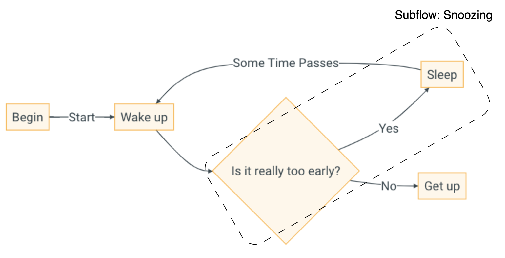

# Exercise 3

Here, you will have to showcase the concept of inheritance in YAMTL using an abstract parent rule and a concrete child rule. In particular, you must create a H1 heading whose value is the culmination of two rules: parent rule and child rule.

## New Input Model

Unlike the previous examples, we will use a new flowchart model that contains subflow element (i.e. flowchart within a flowchart). We will now consider a section of the original flowchart to be a subflow flowchart (named 'Snoozing') with its own implementation of nodes and transitions.




Source model representing the flowchart with subflow instance (in XMI format) conforming to the flowchart domain is as follows:

``` xml
<?xml version="1.0" encoding="UTF-8"?>
<flowchart:Flowchart xmi:version="2.0" xmlns:xmi="http://www.omg.org/XMI" xmlns:xsi="http://www.w3.org/2001/XMLSchema-instance" xmlns:flowchart="flowchart" xmi:id="_9mLMwDY6EeOwt8pm-kjW_Q" name="Wakeup">
  <nodes xsi:type="flowchart:Action" xmi:id="_9mLMwTY6EeOwt8pm-kjW_Q" name="Wake up" outgoing="_9mLMxjY6EeOwt8pm-kjW_Q" incoming="_9mLMyDY6EeOwt8pm-kjW_Q _9mLz0TY6EeOwt8pm-kjW_Q"/>
  <nodes xsi:type="flowchart:Action" xmi:id="_9mLMxDY6EeOwt8pm-kjW_Q" name="Get up" incoming="_9mLz0DY6EeOwt8pm-kjW_Q"/>
  <nodes xsi:type="flowchart:Action" xmi:id="_9mLMxTY6EeOwt8pm-kjW_Q" name="begin" outgoing="_9mLz0TY6EeOwt8pm-kjW_Q"/>
  <nodes xsi:type="flowchart:Subflow" xmi:id="_BYIhADZzEeOvH6AlutIRRw" name="Snoozing">
    <nodes xsi:type="flowchart:Action" xmi:id="_9mLMwzY6EeOwt8pm-kjW_Q" name="Sleep" outgoing="_9mLMyDY6EeOwt8pm-kjW_Q" incoming="_9mLMxzY6EeOwt8pm-kjW_Q"/>
    <nodes xsi:type="flowchart:Decision" xmi:id="_9mLMwjY6EeOwt8pm-kjW_Q" name="Is it really too early?" outgoing="_9mLMxzY6EeOwt8pm-kjW_Q _9mLz0DY6EeOwt8pm-kjW_Q" incoming="_9mLMxjY6EeOwt8pm-kjW_Q"/>
    <transitions xmi:id="_9mLMxzY6EeOwt8pm-kjW_Q" name="Yes" source="_9mLMwjY6EeOwt8pm-kjW_Q" target="_9mLMwzY6EeOwt8pm-kjW_Q"/>
  </nodes>
  <transitions xmi:id="_9mLMxjY6EeOwt8pm-kjW_Q" name="" source="_9mLMwTY6EeOwt8pm-kjW_Q" target="_9mLMwjY6EeOwt8pm-kjW_Q"/>
  <transitions xmi:id="_9mLMyDY6EeOwt8pm-kjW_Q" name="Some Time Passes" source="_9mLMwzY6EeOwt8pm-kjW_Q" target="_9mLMwTY6EeOwt8pm-kjW_Q"/>
  <transitions xmi:id="_9mLz0DY6EeOwt8pm-kjW_Q" name="No" source="_9mLMwjY6EeOwt8pm-kjW_Q" target="_9mLMxDY6EeOwt8pm-kjW_Q"/>
  <transitions xmi:id="_9mLz0TY6EeOwt8pm-kjW_Q" name="start" source="_9mLMxTY6EeOwt8pm-kjW_Q" target="_9mLMwTY6EeOwt8pm-kjW_Q"/>
</flowchart:Flowchart>
```

## Expected Output Model

``` xml
<?xml version="1.0" encoding="ISO-8859-1"?>
<H1 xmi:version="2.0" xmlns:xmi="http://www.omg.org/XMI" xmlns="HTML" value="Subflow Flowchart Snoozing"/>
```

## Task

Inherit the parent rule, to access its implementation and output the combined result of both parent and child rules. The requirements for this problem can be separated into implementing the **parent** rule and the **child** rule.

**Parent Rule**

Define a new rule ‘Flowchart2H1’ and annotate it as abstract. Create one input object ‘f’ of the type ‘Flowchart’ and one output object ‘h1’ of the type ‘H1’. Set the value of the h1 output object to be a concatenated string of “Flowchart ” and the name of ‘f’ input object.

**Child Rule**

Define the next rule as ‘Subflow2H1’ and add the tag inheritsFrom which requires a list of rule names as an argument e.g., `inheritsFrom([<ruleNameList>])`. The only rule we want the child rule to inherit is ‘Flowchart2H1’. Create an input object ‘f’ of the type ‘Subflow’. Remember, rules that inherit from another rule must have the same output object name and type. If they also have the same input names then you can pass child input object to the parent rule. Thus, define an output pattern with the same name and type as the one in the parent rule. Instead of just accessing the implementation of the parent rule, we can extend the functionality of the child rule by adding a lambda expression that sets the value of ‘h1’ output object as the concatenated string of  “Subflow ” and value of ‘h1’ again. Note that the second definition of h1 object inherits the implementation of the parent rule. This means, the subflow name is passed to the output pattern of the parent rule and the h1.value is calculated. This result is then passed to the output pattern of the child rule so the final value of h1 would be ‘Subflow Flowchart Snoozing’.

## Base Transformation

Transformation class containing the MT definition. All rules are defined in the `ruleStore()`.

``` yamtl-groovy
package flowchartToHtmlExamples
import static yamtl.dsl.Rule.*
import org.eclipse.emf.ecore.EPackage
import yamtl.core.YAMTLModule
import yamtl.groovy.YAMTLGroovyExtensions
import yamtl.groovy.YAMTLGroovyExtensions_dynamicEMF

class Example3 extends YAMTLModule {
	public Example3(EPackage flowchartPk, EPackage htmlPk) {
		YAMTLGroovyExtensions_dynamicEMF.init(this)

		header().in("in", flowchartPk).out("out", htmlPk)

		ruleStore([
			//This parent rule is abstract, so it will not be applied directly
			//but it can be executed by its children
			rule('Flowchart2H1')
                //TODO: Implement the parent rule here

			//This child rule inherits from the previous one
			rule('Subflow2H1')
                //TODO: Implement the child rule here

        ])

	}
}
```

## Test Script

This is a separate Groovy class that loads, executes and tests the model transformation. In particular, the source and target metamodels are loaded and passed to the transformation class. Then, the input model is loaded into this class and executed. Thus, creating an output model which is stored and tested for correctness.

``` groovy
package flowchartToHtmlExamples
import static org.junit.Assert.assertTrue;
import org.junit.jupiter.api.Test
import yamtl.core.YAMTLModule
import yamtl.groovy.YAMTLGroovyExtensions
import yamtl.utils.EMFComparator

class Example3Test extends YAMTLModule {
	final BASE_PATH = 'model'

	@Test
	def void testExample3() {
		// model transformation execution
		def srcRes = YAMTLModule.preloadMetamodel(BASE_PATH + '/flowchart.ecore')
		def tgtRes = YAMTLModule.preloadMetamodel(BASE_PATH + '/html.ecore')

		def xform = new Example3(srcRes.contents[0], tgtRes.contents[0])
		YAMTLGroovyExtensions.init(this)
		xform.loadInputModels(['in': BASE_PATH + '/wakeup_with_subflow.xmi'])
		xform.execute()
		xform.saveOutputModels(['out': BASE_PATH + '/example3Output.xmi'])
		
		// test assertion
		def actualModel = xform.getOutputModel('out')
		EMFComparator comparator = new EMFComparator();
		
		// Load the expected model using the identical output metamodel from the transformation.
		// Essentially, use the same in-memory metamodel.
		xform.loadMetamodelResource(tgtRes)
		def expectedResource = xform.loadModel(BASE_PATH + '/example3ExpectedOutput.xmi', false)
		def assertionResult =  comparator.equals(expectedResource.getContents(), actualModel.getContents())
		assertTrue(assertionResult);
	}
}
```