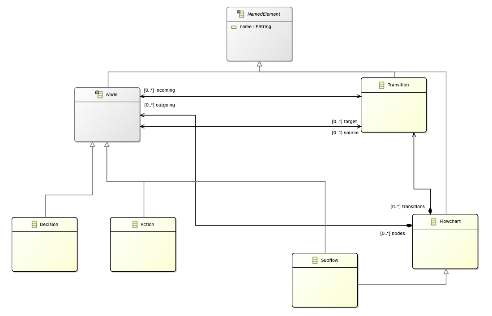
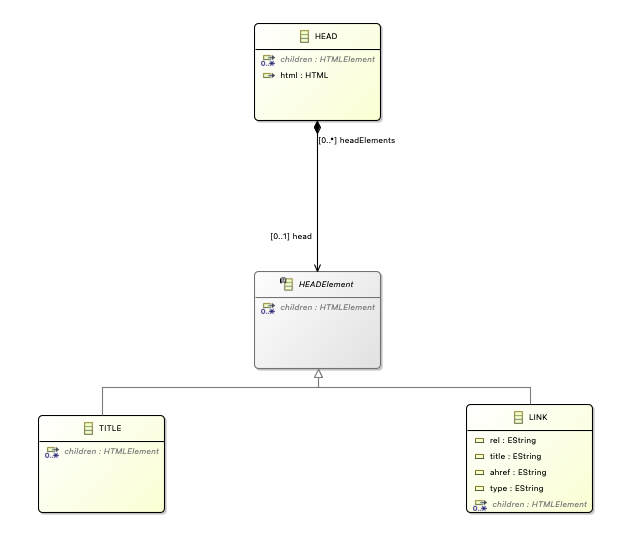
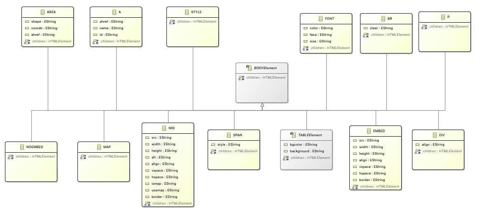
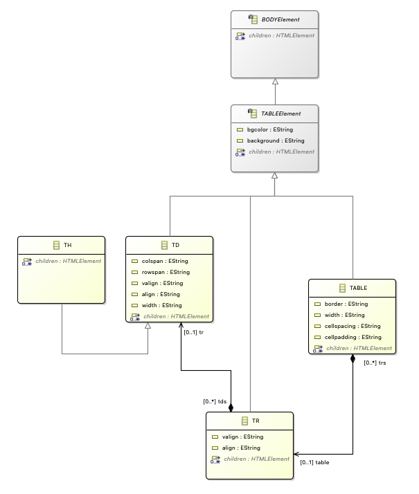
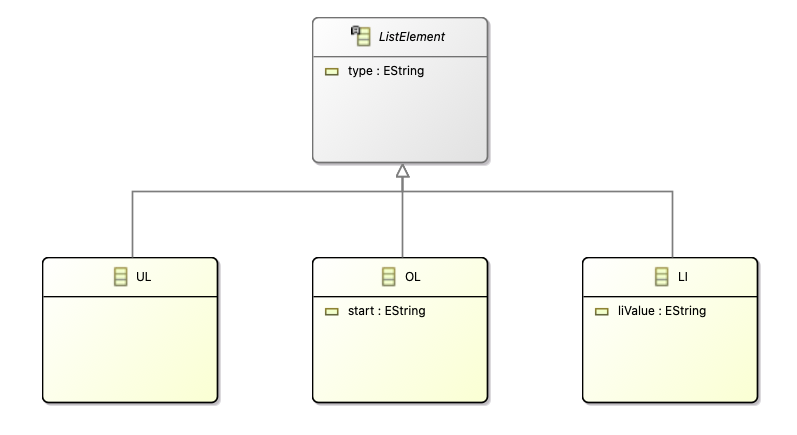

---
hide:
  - path
---

# Flowchart to HTML

## Problem Description

In this worksheet, we will look at converting flowchart elements into HTML elements. The problem is open-ended, meaning, there is no one solution but rather the project will contain many small examples that showcase a multitude of operations for each documented MTL. The flowchart which should be used as the source model of the project is depicted in the diagram below:

<figure markdown style="height:350px;width:400px">
  ``` mermaid
  graph LR
    A[Begin] -->|Start| B[Wake up];
    B --> C{Is it really too early?};
    C --> |Yes| D[Sleep];
    C --> |No| E[Get up]
    D --> |Some Time Passes| B;
  ```
  <figcaption>Wakeup Flowchart</figcaption>
</figure>

Let’s look at the required models for this transformation:

<figure markdown style="height:350px;width:400px">
  ``` mermaid
  graph BT
      B[Source Model] -->|conforms to| A[Flowchart Metamodel];
      C[MT Execution Engine] -->|reads| B;
      C -->|executes| D[MT Definition];
      C -->|writes| E[Target Model];
      D -->|uses| A;
      E -->|conforms to| F[HTML Metamodel];
      D -->|uses| F;
  ```
  <figcaption>Dependencies of the project files</figcaption>
</figure>

Now, let's see how the models are defined.

## Source Metamodel

The source metamodel is defined using Emfatic (.emf), which can be converted into an `ECore` file. You can then access the flowchart classes as `EPackage`s (`ECore` has `EClasses` which are referenced as `EPackage` in Groovy) to be used within the MT definition. Let's view the class diagram and code implementation (in Emfatic) of the source metamodel representing the Flowchart domain.

### Class Diagram



The full metamodel can be read in EMFatic notation [here](https://raw.githubusercontent.com/yamtl/examples/master/FlowchartToHTML_exercises/model/flowchart.emf).

## Target Metamodel

Just like before, the target metamodel is also defined using Emfatic. The metamodel script is long because all HTML elements must be defined so that the transformation generates a valid HTML document. Let's check out the class diagram and code implementation (in Emfatic) of the target metamodel representing the HTML domain.

### Class Diagram

The HTML metamodel is quite large to be viewed as one class diagram, so, let's see different sections of the metamodel for better understanding.

**HTML Section**


**HEADElement Section**



**BODYElement Section**

A lot of body related elements extend the BODYElement class. To show all of those elements the BODYElement section is further divided into 2 sub-sections with a diagram each.

*Sub-section 1:*


*Sub-section 2:*


**TABLEElement Section**



**LISTElement Section**



**Other Classes**


The full metamodel can be read in EMFatic notation [here](https://raw.githubusercontent.com/yamtl/examples/master/FlowchartToHTML_exercises/model/html.emf).

## Fill-the-Gap Exercises

These examples allow learners to practice the use of the YAMTL language at different levels of complexity: 

* [Exercise 1](../exercises-problems/exercise1.md): creating an additional type of object in an output model within a rule.
* [Exercise 2](../exercises-problems/exercise2.md): specifying conditional application of rules.
* [Exercise 3](../exercises-problems/exercise3.md): practicing with rule inheritance.
* [Exercise 4](../exercises-problems/exercise4.md): defining several output elements in a rule to create a complex graph of objects in the output pattern.
* [Exercise 5](../exercises-problems/exercise5.md): using lazy and non-lazy rules.
* [Exercise 6](../exercises-problems/exercise6.md): using helpers.

To solve them go to the [YAMTL playground](https://yamtl.github.io/playground/?activities=https://yamtl.github.io/playground-activities/yamtl-demo-activity.yml).


## Solutions

* [Exercise 1 - Solution](../exercises-solutions/solution1.md)
* [Exercise 2 - Solution](../exercises-solutions/solution2.md)
* [Exercise 3 - Solution](../exercises-solutions/solution3.md)
* [Exercise 4 - Solution](../exercises-solutions/solution4.md)
* [Exercise 5 - Solution](../exercises-solutions/solution5.md)
* [Exercise 6 - Solution](../exercises-solutions/solution6.md)

## References

* [YAMTL Syntax](https://dl.acm.org/doi/10.1145/3239372.3239386)
* [YAMTL Incremental Support](https://link.springer.com/article/10.1007/s10009-020-00583-y)
* [YAMTL Original Documentation](https://arturboronat.github.io/yamtl/)