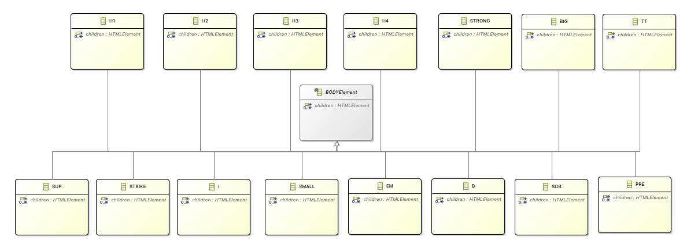
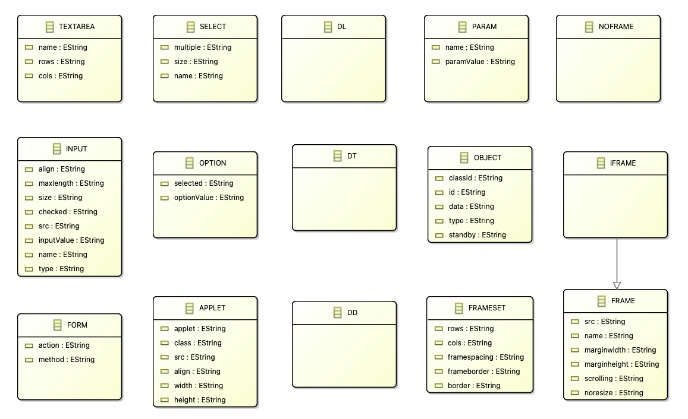

---
hide:
  - path
---

# Flowchart to HTML

## Problem Description

In this worksheet, we will look at converting flowchart elements into HTML elements. The problem is open-ended, meaning, there is no one solution but rather the project will contain many small examples that showcase a multitude of operations for each documented MTL. The flowchart which should be used as the source model of the project is depicted in the diagram below:

<figure markdown style="height:350px;width:400px">
  ``` mermaid
  graph LR
    A[Begin] -->|Start| B[Wake up];
    B --> C{Is it really too early?};
    C --> |Yes| D[Sleep];
    C --> |No| E[Get up]
    D --> |Some Time Passes| B;
  ```
  <figcaption>Wakeup Flowchart</figcaption>
</figure>

Let’s look at the required models for this transformation:

<figure markdown style="height:350px;width:400px">
  ``` mermaid
  graph BT
      B[Source Model] -->|conforms to| A[Flowchart Metamodel];
      C[MT Execution Engine] -->|reads| B;
      C -->|executes| D[MT Definition];
      C -->|writes| E[Target Model];
      D -->|uses| A;
      E -->|conforms to| F[HTML Metamodel];
      D -->|uses| F;
  ```
  <figcaption>Dependencies of the project files</figcaption>
</figure>

Now, let's see how the models are defined.

## Source Metamodel

The source metamodel is defined using Emfatic (.emf), which can be converted into an `ECore` file. You can then access the flowchart classes as `EPackage`s (`ECore` has `EClasses` which are referenced as `EPackage` in Groovy) to be used within the MT definition. Let's view the class diagram and code implementation (in Emfatic) of the source metamodel representing the Flowchart domain.

### Class Diagram


### Code Implementation

```
@namespace(uri="flowchart", prefix="flowchart")
package flowchart;

abstract class NamedElement {
	attr String name;
}

class Flowchart extends NamedElement {
   val Node[*] nodes;
   val Transition[*] transitions;
}

abstract class Node extends NamedElement {
   ref Transition[*]#source outgoing;
   ref Transition[*]#target incoming;
}

class Transition extends NamedElement {
   ref Node#outgoing source;
   ref Node#incoming target;
}

class Action extends Node {
   
}

class Decision extends Node {
   
}

class Subflow extends Flowchart, Node {
   
}
```

## Target Metamodel

Just like before, the target metamodel is also defined using Emfatic. The metamodel script is long because all HTML elements must be defined so that the transformation generates a valid HTML document. Let's check out the class diagram and code implementation (in Emfatic) of the target metamodel representing the HTML domain.

### Class Diagram

The HTML metamodel is quite large to be viewed as one class diagram, so, let's see different sections of the metamodel for better understanding.

**HTML Section**


**HEADElement Section**


**BODYElement Section**

A lot of body related elements extend the BODYElement class. To show all of those elements the BODYElement section is further divided into 2 sub-sections with a diagram each.

*Sub-section 1:*


*Sub-section 2:*


**TABLEElement Section**


**LISTElement Section**


**Other Classes**



### Code Implementation

```
package HTML;
  
  class HTML {
    !ordered val HEAD#html head;
    !ordered val BODY#html body;
  }

  class HTMLElement {
    !unique !ordered attr EString value;
    !ordered val HTMLElement[*] children;
  }

  class HEAD extends HTMLElement {
    !ordered val HEADElement[*]#head headElements;
    !ordered ref HTML#head html;
  }

  abstract class HEADElement extends HTMLElement {
    !ordered ref HEAD#headElements head;
  }

  class LINK extends HEADElement {
    !unique !ordered attr EString rel;
    !unique !ordered attr EString title;
    !unique !ordered attr EString ahref;
    !unique !ordered attr EString type;
  }

  class TITLE extends HEADElement {
  }

  class BODY extends HTMLElement {
    !unique !ordered attr EString background;
    !unique !ordered attr EString bgcolor;
    !unique !ordered attr EString text;
    !unique !ordered attr EString link;
    !unique !ordered attr EString alink;
    !unique !ordered attr EString vlink;
    !ordered val BODYElement[*] bodyElements;
    !ordered ref HTML#body html;
  }

  abstract class BODYElement extends HTMLElement {
  }

  class H1 extends BODYElement {
  }

  class H2 extends BODYElement {
  }

  class H3 extends BODYElement {
  }

  class H4 extends BODYElement {
  }

  class EM extends BODYElement {
  }

  class STRONG extends BODYElement {
  }

  class B extends BODYElement {
  }

  class I extends BODYElement {
  }

  class TT extends BODYElement {
  }

  class PRE extends BODYElement {
  }

  class BIG extends BODYElement {
  }

  class SMALL extends BODYElement {
  }

  class SUB extends BODYElement {
  }

  class SUP extends BODYElement {
  }

  class STRIKE extends BODYElement {
  }

  class FONT extends BODYElement {
    !unique !ordered attr EString color;
    !unique !ordered attr EString face;
    !unique !ordered attr EString size;
  }

  class IMG extends BODYElement {
    !unique !ordered attr EString src;
    !unique !ordered attr EString width;
    !unique !ordered attr EString height;
    !unique !ordered attr EString alt;
    !unique !ordered attr EString align;
    !unique !ordered attr EString vspace;
    !unique !ordered attr EString hspace;
    !unique !ordered attr EString ismap;
    !unique !ordered attr EString usemap;
    !unique !ordered attr EString border;
  }

  class BR extends BODYElement {
    !unique !ordered attr EString clear;
  }

  class MAP extends BODYElement {
  }

  class AREA extends BODYElement {
    !unique !ordered attr EString shape;
    !unique !ordered attr EString coords;
    !unique !ordered attr EString ahref;
  }

  class STYLE extends BODYElement {
  }

  class EMBED extends BODYElement {
    !unique !ordered attr EString src;
    !unique !ordered attr EString width;
    !unique !ordered attr EString height;
    !unique !ordered attr EString align;
    !unique !ordered attr EString vspace;
    !unique !ordered attr EString hspace;
    !unique !ordered attr EString border;
  }

  class NOEMBED extends BODYElement {
  }

  class SPAN extends BODYElement {
    !unique !ordered attr EString style;
  }

  class A extends BODYElement {
    !unique !ordered attr EString ahref;
    !unique !ordered attr EString name;
    !unique !ordered attr EString ~id;
  }

  class DIV extends BODYElement {
    !unique !ordered attr EString align;
  }

  class P extends BODYElement {
  }

  abstract class TABLEElement extends BODYElement {
    !unique !ordered attr EString bgcolor;
    !unique !ordered attr EString background;
  }

  class TABLE extends TABLEElement {
    !unique !ordered attr EString border;
    !unique !ordered attr EString width;
    !unique !ordered attr EString cellspacing;
    !unique !ordered attr EString cellpadding;
    !ordered val TR[*]#table trs;
  }

  class TR extends TABLEElement {
    !unique !ordered attr EString valign;
    !unique !ordered attr EString align;
    !ordered ref TABLE#trs table;
    !ordered val TD[*]#tr tds;
  }

  class TD extends TABLEElement {
    !unique !ordered attr EString colspan;
    !unique !ordered attr EString rowspan;
    !unique !ordered attr EString valign;
    !unique !ordered attr EString align;
    !unique !ordered attr EString width;
    !ordered ref TR#tds tr;
  }

  class TH extends TD {
  }

  class FORM {
    !unique !ordered attr EString action;
    !unique !ordered attr EString method;
  }

  class INPUT {
    !unique !ordered attr EString align;
    !unique !ordered attr EString maxlength;
    !unique !ordered attr EString size;
    !unique !ordered attr EString checked;
    !unique !ordered attr EString src;
    !unique !ordered attr EString inputValue;
    !unique !ordered attr EString name;
    !unique !ordered attr EString type;
  }

  class TEXTAREA {
    !unique !ordered attr EString name;
    !unique !ordered attr EString rows;
    !unique !ordered attr EString cols;
  }

  class SELECT {
    !unique !ordered attr EString multiple;
    !unique !ordered attr EString size;
    !unique !ordered attr EString name;
  }

  class OPTION {
    !unique !ordered attr EString selected;
    !unique !ordered attr EString optionValue;
  }

  abstract class ListElement {
    !unique !ordered attr EString type;
  }

  class OL extends ListElement {
    !unique !ordered attr EString start;
  }

  class UL extends ListElement {
  }

  class LI extends ListElement {
    !unique !ordered attr EString liValue;
  }

  class DL {
  }

  class DT {
  }

  class DD {
  }

  class APPLET {
    !unique !ordered attr EString applet;
    !unique !ordered attr EString ~class;
    !unique !ordered attr EString src;
    !unique !ordered attr EString align;
    !unique !ordered attr EString width;
    !unique !ordered attr EString height;
  }

  class PARAM {
    !unique !ordered attr EString name;
    !unique !ordered attr EString paramValue;
  }

  class OBJECT {
    !unique !ordered attr EString classid;
    !unique !ordered attr EString ~id;
    !unique !ordered attr EString data;
    !unique !ordered attr EString type;
    !unique !ordered attr EString standby;
  }

  class FRAMESET {
    !unique !ordered attr EString rows;
    !unique !ordered attr EString cols;
    !unique !ordered attr EString framespacing;
    !unique !ordered attr EString frameborder;
    !unique !ordered attr EString border;
  }

  class FRAME {
    !unique !ordered attr EString src;
    !unique !ordered attr EString name;
    !unique !ordered attr EString marginwidth;
    !unique !ordered attr EString marginheight;
    !unique !ordered attr EString scrolling;
    !unique !ordered attr EString noresize;
  }

  class NOFRAME {
  }

  class IFRAME extends FRAME {
  }

// Based on https://github.com/SATToSE/SoTeSoLa2012/blob/master/hackathon/modisco-eclipse/org.eclipse.gmt.modisco.tool.metricsvisualizationbuilder/Metamodels/HTML.ecore

```


## Exercises

* [Exercise 1](../exercises-problems/exercise1.md)
* [Exercise 2](../exercises-problems/exercise2.md)
* [Exercise 3](../exercises-problems/exercise3.md)
* [Exercise 4](../exercises-problems/exercise4.md)
* [Exercise 5](../exercises-problems/exercise5.md)
* [Exercise 6](../exercises-problems/exercise6.md)

## Solutions

* [Exercise 1 - Solution](../exercises-solutions/solution1.md)
* [Exercise 2 - Solution](../exercises-solutions/solution2.md)
* [Exercise 3 - Solution](../exercises-solutions/solution3.md)
* [Exercise 4 - Solution](../exercises-solutions/solution4.md)
* [Exercise 5 - Solution](../exercises-solutions/solution5.md)
* [Exercise 6 - Solution](../exercises-solutions/solution6.md)

## References

* [YAMTL Syntax](https://dl.acm.org/doi/10.1145/3239372.3239386)
* [YAMTL Incremental Support](https://link.springer.com/article/10.1007/s10009-020-00583-y)
* [YAMTL Original Documentation](https://arturboronat.github.io/yamtl/)