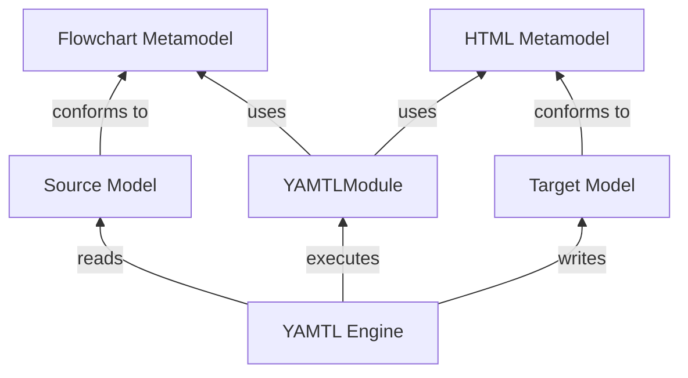
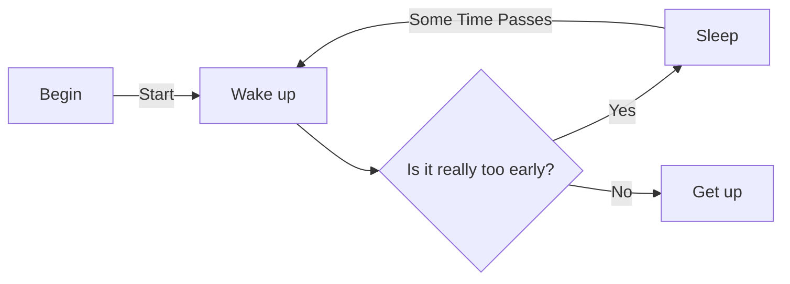
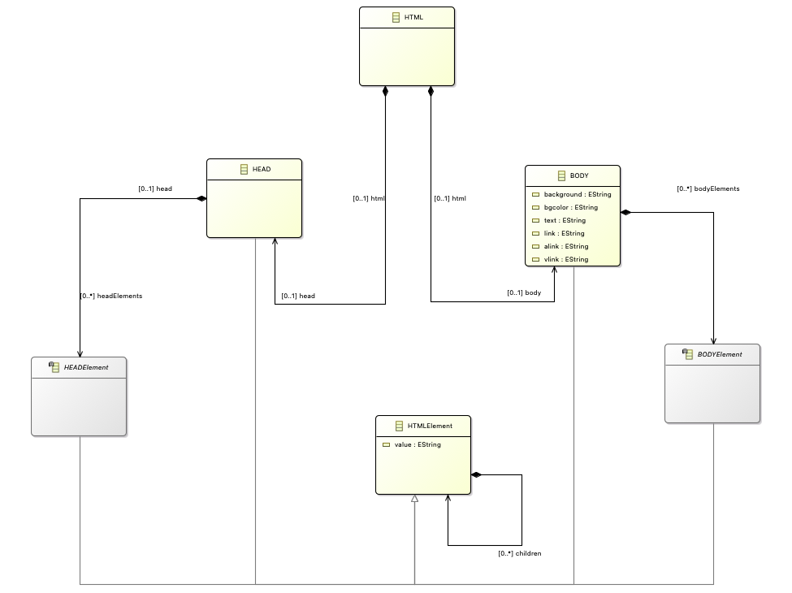

---
hide:
  - path
---

# Flowchart to HTML

In this worksheet, we will look at converting flowchart elements into HTML elements to practice different elements of the YAMTL language.

In the following subsections, you'll find:

* Source metamodel: to define workflows
* Source workflow model that we will use in most of the exercises
* Target metamodel: to define HTML documents
* Fill-in-the gap exercises
* Solutions: **attempt the exercises first!**

These exercises can be solved interactively in the [YAMTL playground](https://yamtl.github.io/playground/?activities=https://yamtl.github.io/playground-activities/yamtl-exercises-activity.yml).

If you prefer to work with them in your IDE of choice, dowload the Gradle project from [here](https://github.com/yamtl/examples/tree/master/FlowchartToHTML_exercises).

## Source Metamodel

The source metamodel is defined using Emfatic (.emf), which can be converted into an `Ecore` file. You can then access the flowchart classes as `EPackage`s (`Ecore` has `EClasses` which are referenced as `EPackage` in Groovy) to be used within the MT definition. Let's view the class diagram and code implementation (in Emfatic) of the source metamodel representing the Flowchart domain.

The full metamodel can be read in Emfatic notation [here](https://raw.githubusercontent.com/yamtl/examples/master/FlowchartToHTML_exercises/model/flowchart.emf).

## Source Model

The flowchart that will be used as source model for most of the exercises is depicted in the diagram below:

## Target Metamodel

Just like before, the target metamodel is also defined using Emfatic. The metamodel script is long because all HTML elements must be defined so that the transformation generates a valid HTML document. Let's check out the class diagram and code implementation (in Emfatic) of the target metamodel representing the HTML domain.

The HTML metamodel is quite large to be viewed as one class diagram, so, let's see different sections of the metamodel for better understanding.

**HTML Section**

**HEADElement Section**

**BODYElement Section**

A lot of body related elements extend the BODYElement class. To show all of those elements the BODYElement section is further divided into 2 sub-sections with a diagram each.

*Sub-section 1:*

*Sub-section 2:*

**TABLEElement Section**

**LISTElement Section**

**Other Classes**

The full metamodel can be read in Emfatic notation [here](https://raw.githubusercontent.com/yamtl/examples/master/FlowchartToHTML_exercises/model/html.emf).

## Fill-the-Gap Exercises

These examples allow learners to practice the use of the YAMTL language at different levels of complexity: 

* [Exercise 1](../exercises-problems/exercise1.md): creating an additional type of object in an output model within a rule.
* [Exercise 2](../exercises-problems/exercise2.md): specifying conditional application of rules.
* [Exercise 3](../exercises-problems/exercise3.md): practicing with rule inheritance.
* [Exercise 4](../exercises-problems/exercise4.md): defining several output elements in a rule to create a complex graph of objects in the output pattern.
* [Exercise 5](../exercises-problems/exercise5.md): using lazy and non-lazy rules.
* [Exercise 6](../exercises-problems/exercise6.md): using helpers.

To solve these exercises interactively, go to the [YAMTL playground](https://yamtl.github.io/playground/?activities=https://yamtl.github.io/playground-activities/yamtl-exercises-activity.yml).

## Solutions

* [Exercise 1 - Solution](../exercises-solutions/solution1.md)
* [Exercise 2 - Solution](../exercises-solutions/solution2.md)
* [Exercise 3 - Solution](../exercises-solutions/solution3.md)
* [Exercise 4 - Solution](../exercises-solutions/solution4.md)
* [Exercise 5 - Solution](../exercises-solutions/solution5.md)
* [Exercise 6 - Solution](../exercises-solutions/solution6.md)

## Documentation

* [YAMTL reference language](https://yamtl.github.io/yamtl-reference.html)