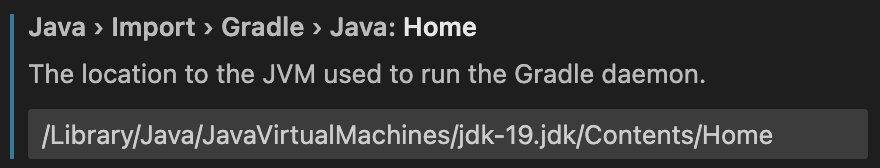

# Choosing an IDE

To use YAMTL appropriately, an IDE must be properly configured. Let"s check out the required configurations for some of the most popular IDEs: Eclipse, IntelliJ, and VSCode.

## Eclipse

Open Eclipse IDE and head over to ```Help → Eclipse Marketplace```. Enter "Groovy" and install ``Groovy Development Tools 5.0.0.RELEASE`` to be able to run Groovy scripts.

Before you run any tasks, make sure your project is using **JDK 17 or higher**.

??? info "How to change the Java version in Eclipse"
    To change your JRE, head over to ``Eclipse → Preferences → Java → Installed JREs → Choose Java SE 17 or higher``

Now you should be ready to use YAMTL in your modeling projects.

## IntelliJ

Head over to ``IntelliJ IDEA → Preferences → Plugins`` and search for ``Eclipse Groovy Compiler Plugin`` and install it.

Similarly, search for "gradle" and install the ``Gradle`` plugin from JetBrains. Restart your IDE to apply the changes.

Ensure the project is using **JDK 17 or higher**.

??? info "How to change the Java version in IntelliJ"
    To change your JDK, head over to ``IntelliJ IDEA → Preferences → Build, Execution, Deployment → Build Tools → Gradle``. Then, select a ``Gradle JVM`` that is **JDK 17 or higher**.

All necessary configurations are now completed!

## VSCode

First, a groovy support package must be installed. ``code-groovy`` extension enables Groovy support for VSCode. In VScode, click on ``Extensions`` and search for "code-groovy". Install the extension from **Marlon Franca**.

Also, install the ``Gradle for Java`` extension published by Microsoft to run the Gradle scripts in a neat interface.

Make sure the workspace is using **JDK 17 or higher**.

??? info "How to change the Java version in VSCode"
    To change your JRE, head over to ``Code → Preferences → Settings`` and search for "JDK". Check the Gradle ``Java: Home`` setting to see if the path points to a location of JDK 17 or higher (update the JDK version if it is any lower).

    

The configurations are completed! [Get started with YAMTL](#getting-started) by installing some dependencies.
